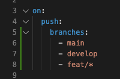
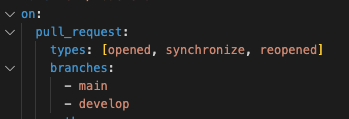
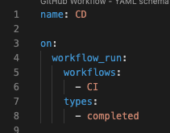
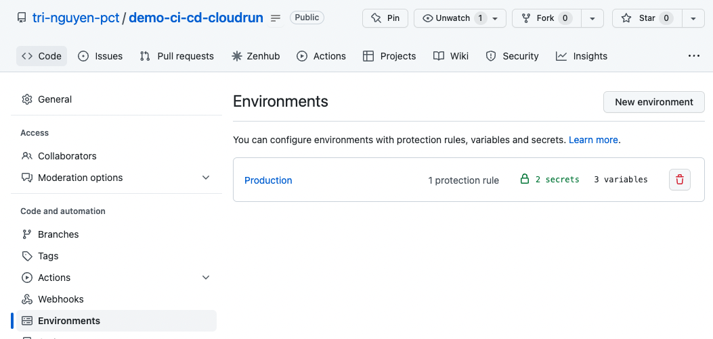
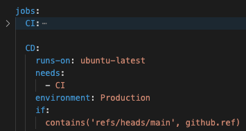

# Demonstration Github Action CI/CD Gcloud Cloudrun

# Table of Contents

1. [Description](#description)
2. [Application instruction](#application-instruction)
   1. [Installation](#installation)
   1. [Running the app](#running-the-app)
3. [What I have learned](#what-i-have-learned)
   1. [Github Action](#github-action)
   2. [CI/CD](#ci-cd)
   3. [GCloud Cloudrun](#gcloud)

## Description

- A very simple NestJS application, which I use to present what I have learned about Github Action, CI/CD and Gcloud (Cloudrun)

## Application instruction

### Installation

```bash
$ npm install
```

### Running the app

```bash
# development
$ npm run start

# watch mode
$ npm run start:dev

# production mode
$ npm run start:prod
```

## What I have learned

### Github Action

- Workflow

  - A workflow is a configurable automated process
    - A workflow is configured by a yaml file, located in directory **_.github/workflows_** in the root of the project
  - A workflow can be triggered by:
    - events
    - manually
    - schedule
  - A workflow can include only one job, or multiple jobs, which can run in sequently or parallel
    - Each job is a group of commands, which tells Github Action what need to do

- Events

  - [Events list](https://docs.github.com/en/actions/using-workflows/events-that-trigger-workflows)

  - Common events:
    - push:
      - [doc](https://docs.github.com/en/actions/using-workflows/events-that-trigger-workflows#push)
      - run workflow when you push a commit or tag
      - 
    - pull_request:
      - [doc](https://docs.github.com/en/actions/using-workflows/events-that-trigger-workflows#pull_request)
      - run workflow when there is an activity about pull request
      - default activities: opened, reopened, synchronize
      - 
    - workflow_run:
      - [doc](https://docs.github.com/en/actions/using-workflows/events-that-trigger-workflows#workflow_run)
      - run workflow when another workflow is requested, in_progress or completed
      - 

- Environments Secrets

  - Environments are used to describe a general deployment target (dev, staging, prod), which includes variables and secrets
    
  - A environment has some protection rules, but I prefer using Deployment branches, with Selected branches, which means only specific branches within the project can use this environment
  - Within a job, we can specific which environment will be used. All the Environment protection rules must pass before that job can receive the Environment. <br />
    

### CI CD

- CI/CD (or CI/CD/CD) is a method to frequently deliver product to customer by introducing automation into development.

  - CI (continuous integration): control code quality of new changes: lint, build, unit test, e2e text, ext

  - CD (continuous delivery): build project and release to repository

  - CD (continuous deployment): deploy result from previous CD to target environment

### GCloud

- Cloudrun
  - Cloudrun is a managed compute platform that lets you run containers
  - Can be used with any programming language like NodeJS, Golang, Python, ... as long as you can build a container from it
  - There are two ways to run your code:
    - Services: application lives long and listens to requests
      - Cloudrun provide a mechanism to auto scaling base on the instance's CPU, we can set the min and max of the numbers of instances a service can scale
    - Jobs: a job runs and quits after finishing its responsibility
